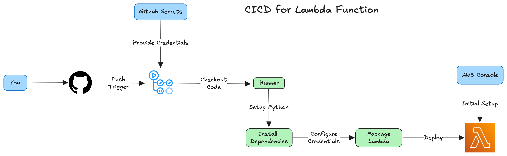

# Lambda - CICD Workflow

- Created a basic Lambda function in AWS Console.
- Created a GitHub Actions Workflow to automatically deploy changes made to the Lambda function.
  - Used GitHub Secrets to store the AWS Credentials used to authenticate and access AWS.
- Changes made in the lambda directory on the main branch will trigger the workflow.
- Result is that the updated Lambda function will be deployed to AWS.

## Workflow Architecture

